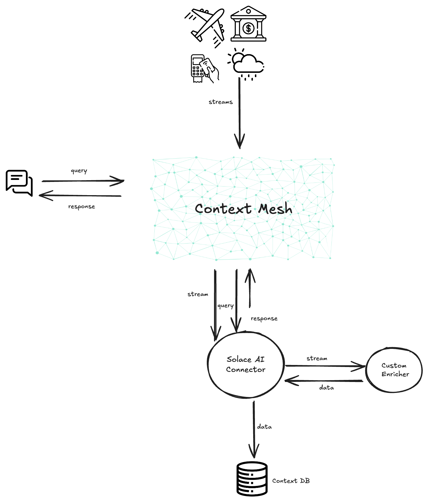

# Realtime RAG Solace Demo


[](https://github.com/TamimiGitHub/solace-context-mesh-demo/pulls)


This demo uses the [Solace AI Connector](https://github.com/SolaceLabs/solace-ai-connector) to build a [Context Mesh](https://solace.com/blog/context-mesh-eda-key-ai-success/)

## Tech Stack

- Python 3
- Solace AI Connector
- Node 18+

## Prerequisites
- Clone the repo
  ```
  git clone git@github.com:TamimiGitHub/solace-context-mesh-demo.git
  ```
  
## To run

Open every section in a separate terminal window

### 1. Solace AI Connector

- Populate the `envVars.env` with the right env varibales. Note: either create a new `envVars.env` or rename the `envVars.env.template`

- Source the environment

```
source envVars.env
```

- [Optional] create a [virtual environment](https://docs.python.org/3/library/venv.html)

```
## Install virtualenv on your maching
python3 -m pip install --user virtualenv
python3 -m venv env
source env/bin/activate
```

Note: You might need to use `python3.8-vnenv` on WSL instead: `apt-get install python3-venv`

- Install the Solace AI Connector

```
python3 -m venv env
source env/bin/activate
pip install --upgrade pip
pip install -r requirements.txt
pip install solace-ai-connector
```

- Run the Solace AI connector with the rag configuration

```
TOPIC_SUB='insert/topic/here/>' solace-ai-connector openai_chroma_rag.yaml
```

### 2. The frontend application

```
npm install
npm start
```

### Cleanup

When done, you can simply delete the vector database and any log files

```
rm -fr chroma_data
rm *.log
```

## Architecure


